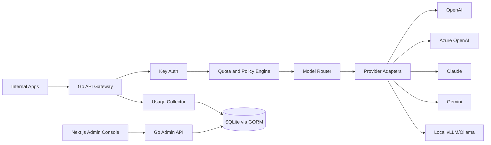

# TokenHub

Language: [English](README.md) | [简体中文](README.zh-CN.md) | 日本語

Enterprise AI Gateway / 企業向け AI アクセス・コストガバナンス基盤

TokenHub は、企業のプライベートデプロイを前提とした AI API Gateway とトークンガバナンスのプラットフォームです。統一されたモデルアクセス入口を提供し、複数のモデル Provider、社内 API Key、クォータ、モデルルーティング、リクエストログ、コスト分析、アラートを一元管理します。これにより、社内アプリケーションは OpenAI、Azure OpenAI、Anthropic Claude、Google Gemini、DeepSeek、Qwen、ローカル vLLM/Ollama などのモデルサービスを、安全かつ制御可能で監査可能な形で利用できます。

本プロジェクトは Go + Next.js で実装されています。

- バックエンド: Go。高並行 API Gateway、Provider Adapter、クォータとルーティングポリシー、監査ログ、課金統計、Admin API を担当します。
- フロントエンド: Next.js。プロジェクト、Key、モデル、クォータ、請求、アラート、監査ビューを含む企業向け管理コンソールを担当します。
- ストレージ: GORM + SQLite によるローカル永続化。設定、クォータカウンタ、監査、利用量、アラート、承認、コストガバナンスのデータは SQLite に保存されます。今後も SQLite-only の方針を維持します。
- デプロイ: Docker Compose、Helm、オフラインパッケージ、企業イントラネット環境でのデプロイをサポートします。

## プロダクトポジショニング

TokenHub の中核価値は、企業向け AI インフラストラクチャです。

- 統一入口: 社内アプリケーションは単一の OpenAI-Compatible API を呼び出すだけで利用できます。
- 統一管理: ユーザー、チーム、プロジェクト、Key 単位で権限、モデル、クォータ、並行数を管理します。
- 統一ガバナンス: モデル、プロジェクト、部門単位で Token、リクエスト数、コスト、異常呼び出しを分析します。
- 統一監査: 重要なリクエスト経路を記録し、機密情報のマスキング、監査証跡、セキュリティアラートをサポートします。
- 統一デプロイ: プライベート、イントラネット、オフライン、Kubernetes でのデプロイをサポートします。

## コアモジュール

| モジュール | 役割 |
| --- | --- |
| 統一 API Gateway | OpenAI-compatible API を公開し、Anthropic、Gemini、カスタムプロトコル向けの入口を予約します |
| Provider 管理 | 呼び出し可能な上流チャネルインスタンスを管理します。Provider 種別、Base URL、API Key、モデルルートマッピング、ヘルス状態を含みます |
| Key 管理 | 企業内ユーザー、チーム、プロジェクト単位で API Key を発行・失効します |
| クォータ管理 | Key とユーザーに対して日次クォータ、月次クォータ、モデル許可リスト、並行数上限を設定します |
| ルーティングポリシー | モデル、コスト、可用性、レイテンシ、リージョン、優先度、重みに基づいてルーティングします |
| 請求統計 | Token、リクエスト数、モデルコスト、プロジェクトコスト、部門コストを集計します |
| 監査とセキュリティ | リクエストログ、機密ワード、データマスキング、異常呼び出し検知、監査証跡を扱います |
| 管理コンソール | ユーザー、チーム、プロジェクト、モデル、Provider、クォータ、請求、アラート、監査を管理します |
| プライベートデプロイ | Docker、Helm、オフラインデプロイ、イントラネットデプロイをサポートします |
| 企業連携 | OIDC、LDAP、DingTalk、Feishu、WeCom、SSO をサポートします |

## MVP スコープ

初期バージョンは 5 つのコア機能にフォーカスします。

1. OpenAI-Compatible Gateway
   - `/v1/chat/completions` をサポート
   - `/v1/responses` をサポート
   - `/v1/embeddings` をサポート
   - ストリーミングレスポンスと標準エラーフォーマットをサポート

2. Provider Adapter
   - OpenAI
   - Azure OpenAI
   - Anthropic Claude
   - Google Gemini
   - DeepSeek
   - Qwen
   - ローカル vLLM/Ollama

3. API Key + Project 管理
   - 各プロジェクトで複数の Key を作成可能
   - モデル許可リスト、クォータ、並行数、期限をサポート
   - Key の有効化、無効化、ローテーション、失効をサポート

4. Token 利用量とコスト統計
   - モデル、プロジェクト、ユーザー、Key、時間単位で統計を集計
   - 入力 Token、出力 Token、総 Token、リクエスト数、エラー率、推定コストをサポート

5. 監査ログとアラート
   - リクエストメタデータ、ルーティング結果、Provider レスポンス状態、利用量、コストを記録
   - 機密フィールドのマスキングをサポート
   - クォータ、エラー率、異常呼び出し、Provider 障害のアラートをサポート

## 全体アーキテクチャ



## 推奨ディレクトリ構成

```text
tokenhub/
  backend/
    cmd/tokenhub/
    internal/
      gateway/
      provider/
      routing/
      quota/
      usage/
      audit/
      admin/
      identity/
      storage/
    migrations/
  frontend/
    app/
    components/
    features/
    lib/
  doc/
  deploy/
    docker-compose/
    helm/
  README.md
```

## ドキュメント

- [プロダクト計画の概要](doc/README.md)
- [プロダクトポジショニングと境界](doc/01-product-positioning.md)
- [システムアーキテクチャ計画](doc/02-architecture.md)
- [MVP とロードマップ](doc/03-mvp-roadmap.md)
- [API 設計](doc/04-api-design.md)
- [データモデル計画](doc/05-data-model.md)
- [管理コンソール計画](doc/06-admin-console.md)
- [デプロイと運用計画](doc/07-deployment-ops.md)
- [セキュリティとコンプライアンス計画](doc/08-security-compliance.md)

## コンプライアンス境界

TokenHub は、企業が所有し、適切に認可されたモデル API アクセスシナリオを対象としています。

- 第三者プロジェクトのコード、SQL、フロントエンドコンポーネント、API 実装、設定構造を直接再利用しません。
- Provider の認証情報は、企業所有の公式 API、クラウドベンダーのインスタンス、または企業が認可したプライベートモデルサービスに由来する必要があります。

## 現在の状態

このリポジトリは MVP 実装段階に入っており、実行可能な Go バックエンドと Next.js 管理コンソールのプロトタイプを含んでいます。

実装済みの主な機能:

- Go バックエンド HTTP サービスとヘルスチェック。
- OpenAI-Compatible Gateway: `/v1/models`、`/v1/chat/completions`、`/v1/responses`、`/v1/embeddings`。
- API Key 認証、プロジェクト紐付け、モデル許可リスト、リクエストクォータ、並行数制限。
- Mock Provider と OpenAI-Compatible、Azure OpenAI、Anthropic、Gemini Adapter の骨格。
- 利用量統計、コスト推定、リクエスト監査、クォータアラート。
- Admin API Bearer Token 認証。
- 日次利用量トレンド API と管理コンソールの棒グラフ。
- プロジェクト、Key、Provider、モデル、ルート、利用量、監査、アラート向け Admin API。
- Provider 管理: 上流 Base URL、API Key、サービス事業者テンプレート、標準モデルマッピング、接続テスト、ヘルス状態。
- ヘルスモニタリング: Provider とモデルルートの手動チェック、状態の書き戻し、失敗時のアラートイベント生成。
- コストガバナンス: コストセンター、予算、部門配賦、内部請求、請求メモ、請求確認/却下、承認フロー、構造化 CSV エクスポート。
- SQLite データ管理: 手動バックアップ、バックアップ一覧、ダウンロード、確認付きリストア、削除。
- Next.js 管理コンソール: 利用分析系の企業ダッシュボード風 UI を参考に、概要、プロジェクト、Provider、モデル、ルート、コストセンター、予算、部門配賦、内部請求、承認、監査、ヘルスモニタリング、アラート、レポートエクスポート、データバックアップ、プロジェクト作成、Provider 作成、標準モデルマッピング、モデルルート作成、Key 発行を含みます。

現在の MVP は GORM + SQLite をデフォルトの永続化層として使用します。プロジェクト、Key、Provider、モデル、ルート、監査、利用量、アラート、承認、通知、管理ユーザー、セッション、バックアップレコードはすべて SQLite に保存されます。今後の本番化では、SQLite を前提にした定期バックアップ、マイグレーション、RBAC、企業 SSO、より完全な Provider 設定管理を進めます。

現在の MVP では、プロダクトモデルを意図的にシンプルに保っています。Provider は呼び出し可能な上流チャネルインスタンスです。企業が複数の上流バックアップを必要とする場合は、複数の Provider を作成し、同一の外部向けモデルの下で複数ルートの優先度と重みを設定します。Provider 内部のより細かなリソースプールは、初版の管理メニューではなく、将来の高度な拡張として扱います。

## ローカル実行

バックエンド:

```bash
cd backend
go run ./cmd/tokenhub
```

デフォルトのデータベースファイルは `backend/data/tokenhub.db` です。`TOKENHUB_DATABASE_URL` で上書きできます。

```bash
TOKENHUB_DATABASE_URL=sqlite:///absolute/path/tokenhub.db go run ./cmd/tokenhub
```

デフォルトのバックアップディレクトリは `backend/data/backups` です。`TOKENHUB_SQLITE_BACKUP_DIR` で上書きできます。

フロントエンド:

```bash
cd frontend
npm install
npm run dev
```

デフォルトアドレス:

- バックエンド API: `http://localhost:8080`
- 管理コンソール: `http://localhost:3000`
- Demo API Key: `thk_demo_local`
- Demo Admin Token: `dev_admin_token`

呼び出し例:

```bash
curl http://localhost:8080/v1/chat/completions \
  -H "Authorization: Bearer thk_demo_local" \
  -H "Content-Type: application/json" \
  -d '{
    "model": "gpt-4.1-mini",
    "messages": [{"role": "user", "content": "hello tokenhub"}]
  }'
```

テスト:

```bash
cd backend
go test ./...

cd ../frontend
npm run typecheck
npm run build
```

Docker Compose:

```bash
cd deploy/docker-compose
docker compose up --build
```
