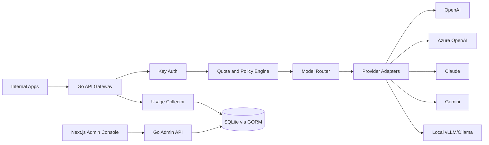

# TokenHub

Language: English | [简体中文](README.zh-CN.md) | [日本語](README.ja.md)

Enterprise AI Gateway / Enterprise AI access and cost governance platform

TokenHub is an AI API Gateway and token governance platform designed for private enterprise deployment. It provides a unified model access layer, centralized management for multiple model Providers, internal API keys, quotas, model routing, request logging, cost analytics, and alerting, so internal applications can use OpenAI, Azure OpenAI, Anthropic Claude, Google Gemini, DeepSeek, Qwen, local vLLM/Ollama, and other model services in a safe, controlled, and auditable way.

The project is implemented with Go + Next.js:

- Backend: Go, responsible for the high-concurrency API gateway, Provider adapters, quota and routing policies, audit logs, billing statistics, and Admin API.
- Frontend: Next.js, responsible for the enterprise admin console, including projects, keys, models, quotas, billing, alerts, and audit views.
- Storage: GORM + SQLite local persistence. Configuration, quota counters, audit logs, usage records, alerts, approvals, and cost governance data are stored in SQLite. The project continues to follow a SQLite-only direction.
- Deployment: Supports Docker Compose, Helm, offline packages, and enterprise intranet deployment.

## Product Positioning

TokenHub focuses on enterprise-grade AI infrastructure:

- Unified access: internal applications only need to call one OpenAI-compatible API.
- Unified control: manage permissions, models, quotas, and concurrency by user, team, project, and key.
- Unified governance: analyze tokens, requests, costs, and abnormal calls by model, project, and department.
- Unified audit: record key request paths with sensitive data masking, audit trails, and security alerts.
- Unified deployment: support private, intranet, offline, and Kubernetes deployment.

## Core Modules

| Module | Purpose |
| --- | --- |
| Unified API Gateway | Exposes OpenAI-compatible APIs and reserves entry points for Anthropic, Gemini, and custom protocols |
| Provider Management | Manages callable upstream channel instances, including provider type, Base URL, API key, model route mappings, and health status |
| Key Management | Issues and revokes API keys by enterprise user, team, and project |
| Quota Management | Configures daily quotas, monthly quotas, model allowlists, and concurrency limits for keys and users |
| Routing Policy | Routes by model, cost, availability, latency, region, priority, and weight |
| Billing Statistics | Tracks tokens, request counts, model costs, project costs, and department costs |
| Audit and Security | Request logs, sensitive-word policies, data masking, anomaly detection, and audit trails |
| Admin Console | Users, teams, projects, models, Providers, quotas, billing, alerts, and audit |
| Private Deployment | Docker, Helm, offline deployment, and intranet deployment |
| Enterprise Integration | OIDC, LDAP, DingTalk, Feishu, WeCom, and SSO |

## Product Capabilities

TokenHub currently provides five core capability areas:

1. OpenAI-Compatible Gateway
   - Supports `/v1/chat/completions`
   - Supports `/v1/responses`
   - Supports `/v1/embeddings`
   - Supports streaming responses and standard error formats

2. Provider Adapter
   - OpenAI
   - Azure OpenAI
   - Anthropic Claude
   - Google Gemini
   - DeepSeek
   - Qwen
   - Local vLLM/Ollama

3. API Key + Project Management
   - Each project can create multiple keys
   - Supports model allowlists, quotas, concurrency limits, and expiration time
   - Supports enabling, disabling, rotating, and revoking keys

4. Token Usage and Cost Statistics
   - Statistics by model, project, user, key, and time
   - Supports input tokens, output tokens, total tokens, request count, error rate, and estimated cost

5. Audit Logs and Alerts
   - Records request metadata, routing results, Provider response status, usage, and cost
   - Supports sensitive field masking
   - Supports alerts for quotas, error rates, abnormal calls, and Provider outages

## Architecture



## Documentation

- [Documentation home](docs/README.md)
- [Quick start](docs/quick-start.md)
- [Model API](docs/model-api.md)
- [Admin console](docs/admin-console.md)
- [Model catalog](docs/model-catalog.md)
- [Deployment](docs/deployment.md)
- [Security](docs/security.md)
- Other languages: [简体中文](docs/zh-CN/README.md) | [日本語](docs/ja/README.md)

## Compliance Boundary

TokenHub is intended for enterprise-owned and properly authorized model API access scenarios:

- It does not directly reuse code, SQL, frontend components, API implementations, or configuration structures from third-party projects.
- Provider credentials should come from enterprise-owned official APIs, cloud vendor instances, or enterprise-authorized private model services.

## Current Status

The repository now includes a runnable Go backend and Next.js admin console with the main enterprise gateway, governance, observability, and administration workflows in place.

Current implementation includes:

- Go backend HTTP service and health check.
- OpenAI-Compatible Gateway: `/v1/models`, `/v1/chat/completions`, `/v1/responses`, `/v1/embeddings`.
- API key authentication, project binding, model allowlists, request quotas, and concurrency limits.
- Mock Provider for offline validation, plus Provider adapters for OpenAI-compatible, Azure OpenAI, Anthropic, and Gemini.
- Usage statistics, cost estimation, request logging, and quota alerts.
- Admin API Bearer Token authentication.
- Daily usage trend API and admin console bar chart.
- Admin API for projects, keys, Providers, models, routes, usage, audit logs, and alerts.
- Provider management: upstream Base URL, API key, provider templates, standard model mappings, connection testing, and health status.
- Health monitoring: manual checks for Providers and model routes, status write-back, and alert events on failure.
- Cost governance: cost centers, project quota controls, member and Provider cost breakdowns, quota-increase approvals, and structured CSV export.
- SQLite data management: manual backups, backup list, download, confirmation-based restore, and deletion.
- Next.js admin console: an enterprise dashboard style covering overview, interface documentation, projects, API keys, users, teams, Providers, models, route catalog, playground, usage analytics, request logs, cost centers, cost billing, approvals, health checks, alert rules and events, notification channels, report export, data backup, settings, project creation, Provider creation, standard model mapping, model route creation, and key issuance.

TokenHub currently uses GORM + SQLite as the default persistence layer. Projects, keys, Providers, models, routes, request logs, usage, alerts, approvals, notifications, admin users, sessions, and backup records are all stored in SQLite. Ongoing hardening focuses on SQLite-based scheduled backups, migrations, RBAC, enterprise SSO, credential encryption, and more complete Provider configuration management.

The current product model intentionally keeps Provider routing clear: a Provider is a callable upstream channel instance. If an enterprise needs multiple upstream backups, it can create multiple Providers and configure route priorities and weights under the same external model. More granular resource pools inside a Provider are treated as advanced extensions rather than default admin concepts.

## Local Development

Backend:

```bash
cd backend
go run ./cmd/tokenhub
```

The default database file is `backend/data/tokenhub.db`. Override it with `TOKENHUB_DATABASE_URL`, for example:

```bash
TOKENHUB_DATABASE_URL=sqlite:///absolute/path/tokenhub.db go run ./cmd/tokenhub
```

The default backup directory is `backend/data/backups`. Override it with `TOKENHUB_SQLITE_BACKUP_DIR`.

Model catalog:

The standard model catalog is maintained in `data/model-catalog.yaml`. TokenHub imports this YAML file into SQLite on backend startup and updates existing catalog rows by model name. When public model lists change, update the YAML file instead of editing Go seed code.

You can override the catalog path with `TOKENHUB_MODEL_CATALOG_FILE`. Docker images copy the catalog to `/app/catalog/model-catalog.yaml` so it is not hidden by the `/app/data` SQLite volume.

Frontend:

```bash
cd frontend
npm install
npm run dev
```

Default addresses:

- Backend API: `http://localhost:8080`
- Admin console: `http://localhost:3000`
- Demo API Key: `thk_demo_local`
- Demo Admin Token: `dev_admin_token`

Example request:

```bash
curl http://localhost:8080/v1/chat/completions \
  -H "Authorization: Bearer thk_demo_local" \
  -H "Content-Type: application/json" \
  -d '{
    "model": "gpt-4.1-mini",
    "messages": [{"role": "user", "content": "hello tokenhub"}]
  }'
```

Tests:

```bash
cd backend
go test ./...

cd ../frontend
npm run typecheck
npm run build
```

Docker Compose:

```bash
cd deploy/docker-compose
docker compose up --build
```

## License

TokenHub is licensed under the [Apache License 2.0](LICENSE).
