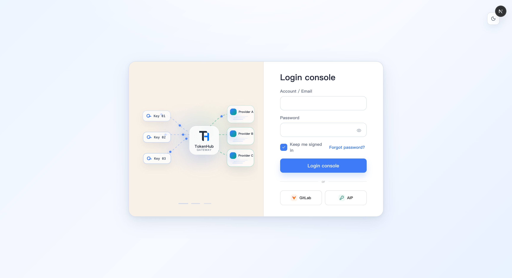
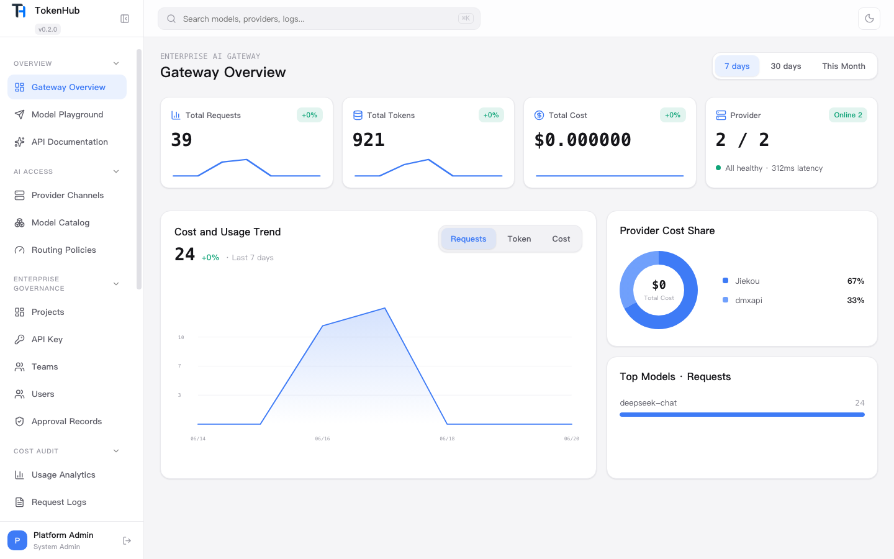
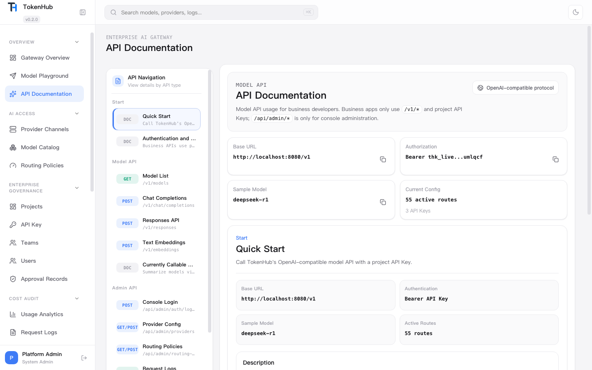
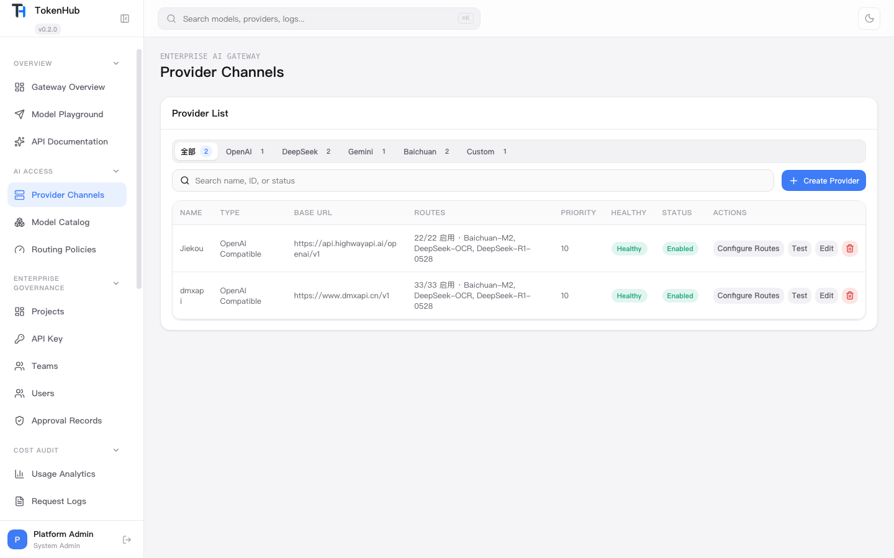
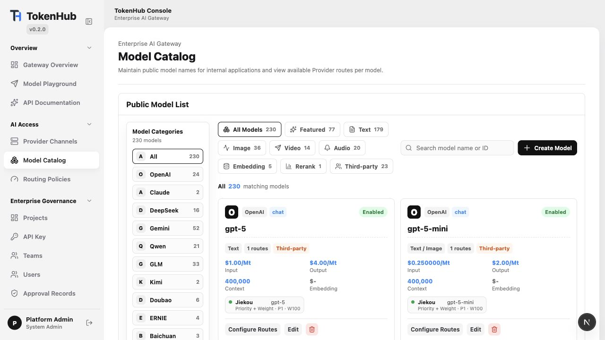
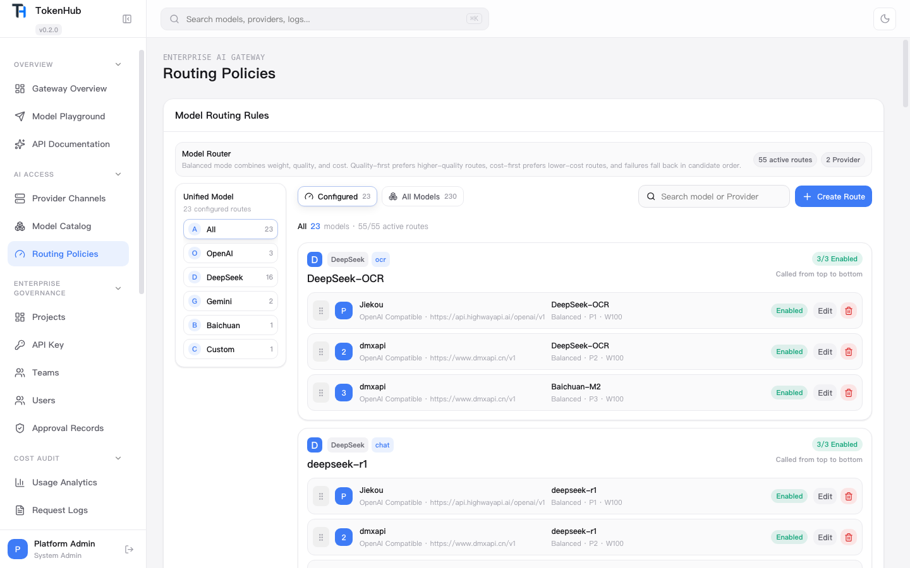
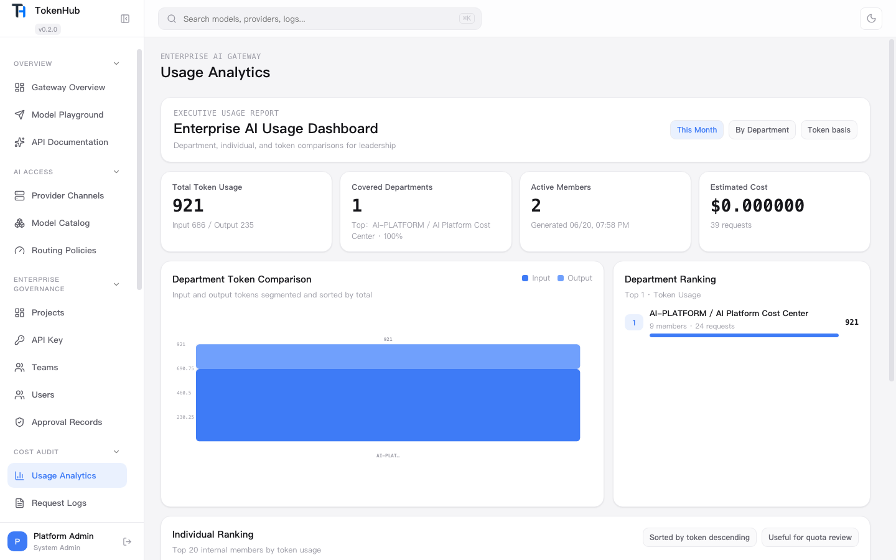
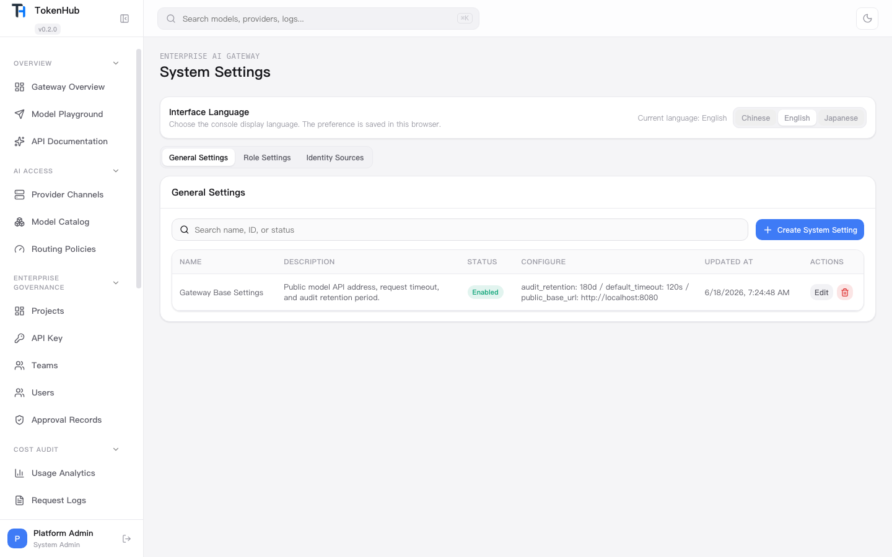

<p align="center">
  
</p>

<h1 align="center">TokenHub</h1>

<p align="center">
  TokenHub is a private enterprise AI gateway with role-based workspaces for users, team leaders, and administrators.
</p>

<p align="center">
  <a href="LICENSE"></a>
  
  
  
  
  
  
  
</p>

<p align="center">
  English | <a href="README.zh-CN.md">简体中文</a> | <a href="README.ja.md">日本語</a>
</p>

## Screenshots

| Login Console | Gateway Overview |
| --- | --- |
|  |  |
| API Documentation | Provider Channels |
|  |  |
| Model Catalog | Routing Policies |
|  |  |
| Usage Analytics | System Settings |
|  |  |

## Designed Around Three Roles

TokenHub separates everyday model usage, team governance, and platform administration so enterprise users see the workflows that match their responsibility.

| Role | Workspace Focus | Guide |
| --- | --- | --- |
| User | Find available models, create project-scoped API keys, call the model API, and review personal usage | [User Guide](docs/user-guide.md) |
| Team Leader | Manage project spaces, project members, project keys, team reports, and project cost attribution | [Team Leader Guide](docs/team-leader-guide.md) |
| Administrator | Configure providers, model catalog, routing policies, identity sources, RBAC, audit, and cost controls | [Administrator Guide](docs/administrator-guide.md) |

## Platform Capabilities

- OpenAI-compatible model APIs: `/v1/chat/completions`, `/v1/responses`, `/v1/embeddings`.
- Provider channels for OpenAI-compatible, Azure OpenAI, Anthropic, Gemini, DeepSeek, Qwen, local vLLM/Ollama, and custom upstreams.
- Model catalog and routing policies with priority, weight, failover order, and route health diagnostics.
- Project-scoped key management with team ownership, member permissions, quotas, and concurrency controls.
- Usage analytics and request logs attributed to user, project, team, model, and cost center.
- Identity source configuration for OAuth/OIDC enterprise sign-in, plus RBAC and audit trails.
- Clean console with compact role-aware navigation, global search, light/dark mode, and split-view API documentation.
- SQLite-first private deployment with Docker Compose support.
- PostgreSQL support for production deployments with connection pooling.
- Console language switching for English, Chinese, and Japanese.

## Quick Start

```bash
cp deploy/.env.example deploy/.env
docker compose --env-file deploy/.env -f deploy/docker-compose.yml up -d --build
```

Open:

- Admin console: `http://localhost:3000`
- Backend API: `http://localhost:8080`
- Health check: `http://localhost:8080/healthz`

Default admin login:

- Username: `admin`
- Password: `admin123456`

Change the default password and secrets in `deploy/.env` before exposing TokenHub beyond a local machine.

## Local Development

Backend:

```bash
cd backend
go run ./cmd/tokenhub
```

Frontend:

```bash
cd frontend
npm install
npm run dev
```

Smoke-test the model API with the included SDK example:

```bash
cd sdk
npm install
npm run test:deepseek
```

## Documentation

- [Documentation home](docs/README.md)
- [User Guide](docs/user-guide.md)
- [Team Leader Guide](docs/team-leader-guide.md)
- [Administrator Guide](docs/administrator-guide.md)
- [简体中文文档](docs/zh-CN/README.md)
- [日本語ドキュメント](docs/ja/README.md)

## License

TokenHub is licensed under the [Apache License 2.0](LICENSE).
