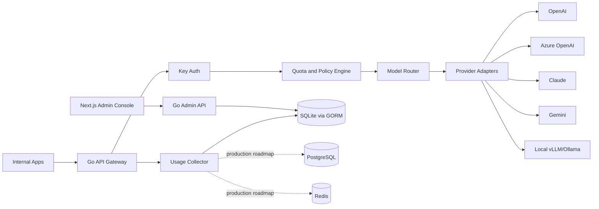

# TokenHub

Enterprise AI Gateway / 企业 AI 访问与成本治理平台

TokenHub 是一个面向企业私有化部署的 AI API Gateway 与 Token 治理平台。它为企业提供统一的模型访问入口，集中管理多模型 Provider、内部 API Key、额度分配、模型路由、调用审计、成本分析与告警，让内部应用可以安全、可控、可追踪地使用 OpenAI、Azure OpenAI、Anthropic Claude、Google Gemini、DeepSeek、Qwen、本地 vLLM/Ollama 等模型能力。

本项目采用 Go + Next.js 实现：

- 后端：Go，负责高并发 API 网关、Provider Adapter、额度与路由策略、审计日志、计费统计、管理 API。
- 前端：Next.js，负责企业管理后台，包括项目、Key、模型、额度、账单、告警与审计视图。
- 存储：当前实现使用 GORM，默认 SQLite 本地持久化；生产规划可切换 PostgreSQL，并引入 Redis 承载限流、额度缓存、异步队列与短周期统计缓存。
- 部署：支持 Docker Compose、Helm、离线包与企业内网部署。

## 产品定位

Provider credentials should come from enterprise-owned official APIs, cloud vendor instances, or enterprise-authorized private model services.

TokenHub 的核心价值是企业级 AI 基础设施：

- 统一入口：内部应用只需要调用统一的 OpenAI-Compatible API。
- 统一管控：按用户、团队、项目、Key 维度管理权限、模型、额度和并发。
- 统一治理：按模型、项目、部门统计 Token、请求数、成本和异常调用。
- 统一审计：记录关键调用链路，支持敏感内容脱敏、审计留痕和安全告警。
- 统一部署：支持私有化、内网、离线和 Kubernetes 部署。

## 核心模块

| 模块 | 作用 |
| --- | --- |
| 统一 API 网关 | 对外兼容 OpenAI API，并预留 Anthropic、Gemini、自定义协议入口 |
| Provider 管理 | 管理 OpenAI、Azure OpenAI、Claude、Gemini、DeepSeek、Qwen、本地模型等 |
| Key 管理 | 按企业内部用户、团队、项目维度发放和吊销 API Key |
| 额度管理 | 为 Key、用户、项目设置日额度、月额度、模型白名单、并发上限 |
| 路由策略 | 按模型、成本、可用性、延迟、区域、优先级进行路由 |
| 计费统计 | 统计 Token、请求数、模型成本、项目成本、部门成本 |
| 审计与安全 | 请求日志、敏感词、数据脱敏、异常调用检测、审计留痕 |
| 管理后台 | 用户、团队、项目、模型、Provider、额度、账单、告警、审计 |
| 私有化部署 | Docker、Helm、离线部署、内网部署 |
| 企业集成 | OIDC、LDAP、钉钉、飞书、企业微信、SSO |

## MVP 范围

第一版聚焦 5 个核心能力：

1. OpenAI-Compatible Gateway
   - 支持 `/v1/chat/completions`
   - 支持 `/v1/responses`
   - 支持 `/v1/embeddings`
   - 支持流式响应与标准错误格式

2. Provider Adapter
   - OpenAI
   - Azure OpenAI
   - Anthropic Claude
   - Google Gemini
   - DeepSeek
   - Qwen
   - 本地 vLLM/Ollama

3. API Key + Project 管理
   - 每个项目可创建多个 Key
   - 支持模型白名单、额度、并发、过期时间
   - 支持 Key 启停、轮换、吊销

4. Token 用量与成本统计
   - 按模型、项目、用户、Key、时间维度统计
   - 支持输入 Token、输出 Token、总 Token、请求数、错误率、估算成本

5. 审计日志与告警
   - 记录请求元信息、路由结果、Provider 响应状态、用量与成本
   - 支持敏感字段脱敏
   - 支持额度、错误率、异常调用、Provider 不可用告警

## 总体架构



## 建议目录结构

```text
tokenhub/
  backend/
    cmd/tokenhub/
    internal/
      gateway/
      provider/
      routing/
      quota/
      usage/
      audit/
      admin/
      identity/
      storage/
    migrations/
  frontend/
    app/
    components/
    features/
    lib/
  doc/
  deploy/
    docker-compose/
    helm/
  README.md
```

## 文档

- [产品规划总览](doc/README.md)
- [产品定位与边界](doc/01-product-positioning.md)
- [系统架构规划](doc/02-architecture.md)
- [MVP 与路线图](doc/03-mvp-roadmap.md)
- [API 设计](doc/04-api-design.md)
- [数据模型规划](doc/05-data-model.md)
- [管理后台规划](doc/06-admin-console.md)
- [部署与运维规划](doc/07-deployment-ops.md)
- [安全与合规规划](doc/08-security-compliance.md)

## 合规边界

TokenHub 只面向企业自有、合规授权的模型 API 访问场景：

- 不直接复用任何第三方项目的代码、SQL、前端组件、接口实现或配置结构。
- 不以规避上游服务条款、风控或计费规则作为产品卖点。
- 不承诺规避官方 API 费用。
- 不把个人 Claude、ChatGPT、Gemini 等订阅转成API 分发 分发作为核心功能。
- Provider 凭证应来自企业自有账号、官方 API、云厂商实例或企业授权的私有模型服务。

## 当前状态

当前仓库已进入 MVP 实现阶段，包含一个可运行的 Go 后端与 Next.js 管理后台原型。

已实现的第一批能力：

- Go 后端 HTTP 服务与健康检查。
- OpenAI-Compatible Gateway：`/v1/models`、`/v1/chat/completions`、`/v1/responses`、`/v1/embeddings`。
- API Key 鉴权、项目绑定、模型白名单、请求额度、并发限制。
- Mock Provider 与 OpenAI-Compatible、Azure OpenAI、Anthropic、Gemini Adapter 骨架。
- 用量统计、成本估算、请求审计、额度告警。
- Admin API Bearer Token 认证。
- 日粒度用量趋势接口与后台柱状图。
- Admin API：项目、Key、Provider、模型、用量、审计、告警。
- Next.js 管理后台：参考用量分析类企业后台风格，包含总览、项目、Provider、模型、路由、审计、告警、创建项目、创建 Provider、创建模型路由、发放 Key。

MVP 当前已使用 GORM + SQLite 做默认持久化，项目、Key、Provider、模型、路由、审计、用量、告警、后台用户与会话都会落库。后续生产化仍建议补齐 PostgreSQL、Redis、RBAC 和更完整的 Provider 配置管理。

## 本地运行

后端：

```bash
cd backend
go run ./cmd/tokenhub
```

默认数据库文件为 `backend/data/tokenhub.db`。可通过 `TOKENHUB_DATABASE_URL` 覆盖，例如：

```bash
TOKENHUB_DATABASE_URL=sqlite:///absolute/path/tokenhub.db go run ./cmd/tokenhub
```

前端：

```bash
cd frontend
npm install
npm run dev
```

默认地址：

- 后端 API：`http://localhost:8080`
- 前端后台：`http://localhost:3000`
- Demo API Key：`thk_demo_local`
- Demo Admin Token：`dev_admin_token`

调用示例：

```bash
curl http://localhost:8080/v1/chat/completions \
  -H "Authorization: Bearer thk_demo_local" \
  -H "Content-Type: application/json" \
  -d '{
    "model": "gpt-4.1-mini",
    "messages": [{"role": "user", "content": "hello tokenhub"}]
  }'
```

测试：

```bash
cd backend
go test ./...

cd ../frontend
npm run typecheck
npm run build
```

Docker Compose：

```bash
cd deploy/docker-compose
docker compose up --build
```
