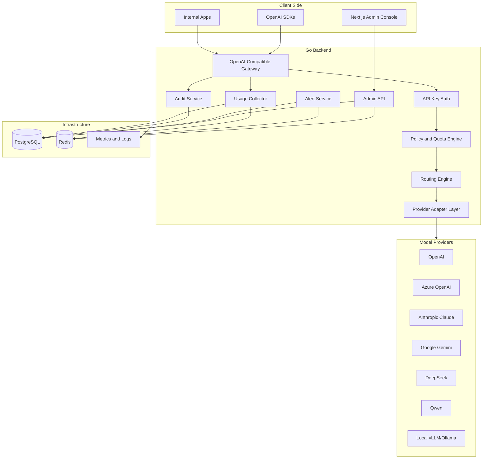
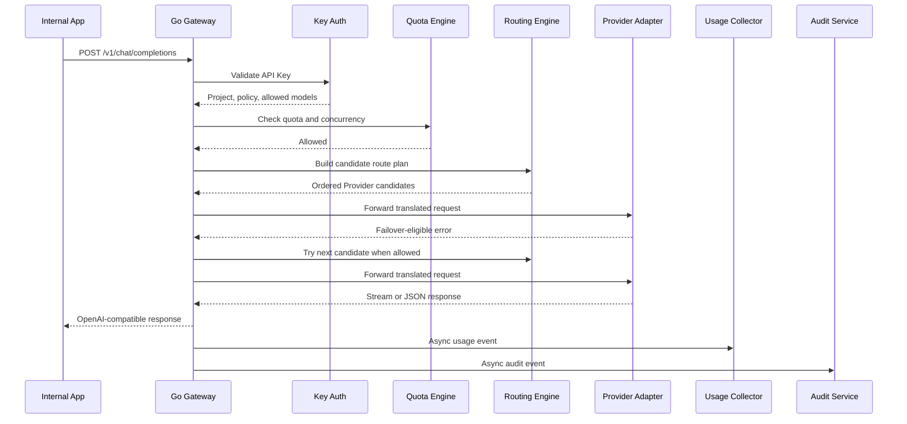

# 系统架构规划

## 技术选型

| 层 | 技术 |
| --- | --- |
| API Gateway | Go |
| Admin API | Go |
| 前端后台 | Next.js + TypeScript |
| 主数据库 | PostgreSQL |
| 缓存与限流 | Redis |
| 异步任务 | Redis Stream 或独立队列抽象 |
| 部署 | Docker Compose、Helm |
| 观测 | OpenTelemetry、Prometheus、Grafana、结构化日志 |

## 总体架构



## 后端模块

| 模块 | 职责 |
| --- | --- |
| gateway | 暴露 OpenAI-Compatible API，处理请求解析、流式响应、错误格式 |
| identity | 管理用户、团队、角色、SSO、OIDC、LDAP |
| project | 管理项目、项目成员、项目级策略 |
| key | API Key 创建、哈希存储、轮换、吊销、有效期 |
| provider | Provider 配置、凭证、健康检查、模型清单 |
| adapter | 将统一内部请求转换成 OpenAI、Azure、Anthropic、Gemini 等协议 |
| routing | 基于模型、成本、延迟、可用性、优先级的路由决策 |
| quota | 日额度、月额度、Token 限额、请求限额、并发限额 |
| usage | Token 统计、请求统计、成本计算、聚合任务 |
| audit | 请求日志、管理操作日志、安全事件 |
| alert | 额度、错误率、成本异常、Provider 不可用告警 |
| admin | 管理后台 API |
| storage | 数据库、缓存、事务、迁移 |

## 推荐后端目录

```text
backend/
  cmd/tokenhub/
    main.go
  internal/
    app/
    config/
    logger/
    gateway/
    admin/
    identity/
    project/
    key/
    provider/
    adapter/
      openai/
      azureopenai/
      anthropic/
      gemini/
      openaicompat/
      local/
    routing/
    quota/
    usage/
    audit/
    alert/
    storage/
      postgres/
      redis/
  migrations/
  api/
    openapi/
```

## 前端模块

| 模块 | 页面 |
| --- | --- |
| Overview | 总览、请求量、Token、成本、错误率、Provider 状态 |
| Projects | 项目列表、项目详情、成员、Key、额度 |
| API Keys | Key 创建、轮换、禁用、模型白名单、并发限制 |
| Providers | Provider 列表、凭证、模型映射、健康检查 |
| Models | 统一模型目录、别名、成本单价、上下文长度 |
| Routing | 路由规则、优先级、降级、灰度 |
| Usage | 用量趋势、成本分析、项目/模型/用户维度报表 |
| Audit | 请求审计、管理操作日志、安全事件 |
| Alerts | 告警规则、告警历史、通知渠道 |
| Settings | SSO、LDAP、企业集成、系统配置 |

## 请求链路



## 内部统一请求模型

网关层不应该把业务逻辑绑定在某个 Provider 的原始请求结构上。建议在内部定义统一的模型调用对象：

| 对象 | 说明 |
| --- | --- |
| ModelRequest | 统一请求，包含模型、消息、输入、工具、流式参数、元数据 |
| ModelResponse | 统一响应，包含文本、工具调用、Token 用量、停止原因 |
| ProviderRoute | 一次调用选择的 Provider、资源实例、模型映射和策略信息 |
| UsageEvent | 请求完成后的 Token、成本、延迟、状态、错误信息 |
| AuditEvent | 用于审计的调用元信息、主体、项目、IP、策略命中 |

Provider Adapter 只负责协议转换，不负责额度、鉴权、审计和成本归属。

## 路由策略

MVP 阶段支持以下策略：

- 精确模型映射：`gpt-4.1-mini` -> OpenAI 或 Azure OpenAI。
- 优先级路由：先按管理员配置的优先级选择候选 Provider。
- 加权路由：同一优先级内可按权重分配请求。
- 健康检查跳过：Provider 不可用时自动跳过。
- Provider failover：非流式请求遇到 429、502、503、504 或 5xx 时尝试下一个候选。

后续版本增加：

- 成本优先。
- 延迟优先。
- 区域优先。
- 质量评分。
- 灰度路由。
- 多 Provider 预算均衡。
- Provider 资源池调度、粘性会话、资源级熔断和冷却。

## 数据流

| 数据 | 写入路径 | 查询路径 |
| --- | --- | --- |
| API 请求 | Gateway -> Audit/Usage | Audit、Usage、Dashboard |
| Token 用量 | Adapter response -> Usage Collector | Usage aggregation |
| Provider 健康 | Health job -> Redis/PostgreSQL | Router、Admin |
| Key 配置 | Admin API -> PostgreSQL | Gateway auth cache |
| 额度状态 | Gateway -> Redis counters -> PostgreSQL aggregation | Quota、Dashboard |

## 高可用规划

MVP 可以先支持单实例部署，但设计上应满足横向扩展：

- Go Gateway 无状态化。
- API Key、Project、Policy 缓存在 Redis，数据库为最终来源。
- 限流和额度计数使用 Redis 原子操作。
- 使用 PostgreSQL 行级锁或幂等事件避免统计重复。
- Provider 健康状态可被多实例共享。
- 管理后台不直接访问数据库，只通过 Admin API。

## 可观测性

必须打通以下观测维度：

- 请求 ID：贯穿入口、路由、Provider、日志、审计。
- 指标：QPS、延迟、错误率、Token、成本、Provider 成功率。
- 日志：结构化 JSON 日志，敏感字段默认脱敏。
- Trace：OpenTelemetry 追踪关键链路。
- 告警：Provider 不可用、额度耗尽、错误率升高、成本突增。
