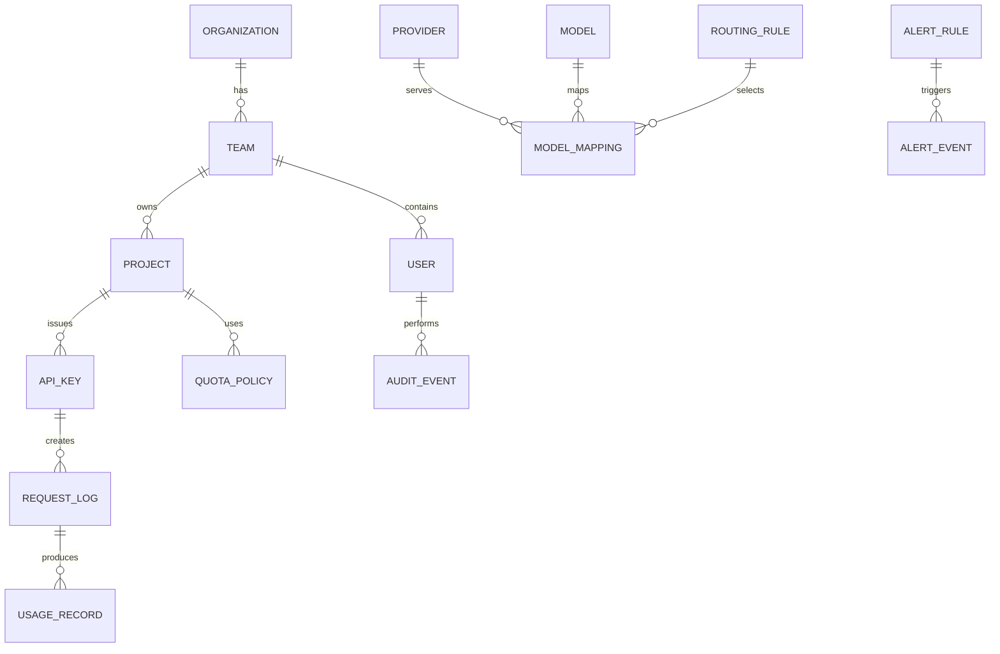

# 数据模型规划

## 设计原则

- API Key 明文不入库，只保存哈希和前后缀。
- Provider 资源凭证加密保存，密钥由环境变量或外部 KMS 管理。
- 请求正文默认不完整落库，优先保存摘要、哈希、Token、元信息和策略命中结果。
- 用量明细与聚合表分离，避免 Dashboard 查询拖慢网关写入。
- 额度计数、配置源和统计归档统一使用 SQLite，保持 SQLite-only 部署形态。

## 核心实体

## 表规划

### organizations

企业租户。私有化单租户部署也建议保留该实体，便于后续 SaaS 或多组织扩展。

| 字段 | 说明 |
| --- | --- |
| id | 主键 |
| name | 企业名称 |
| status | active、disabled |
| created_at / updated_at | 时间戳 |

### teams

团队或部门。

| 字段 | 说明 |
| --- | --- |
| id | 主键 |
| organization_id | 企业 ID |
| parent_id | 上级团队，可空 |
| name | 团队名称 |
| cost_center | 成本中心 |
| status | active、disabled |

### users

后台用户和企业身份用户。

| 字段 | 说明 |
| --- | --- |
| id | 主键 |
| organization_id | 企业 ID |
| team_id | 所属团队 |
| email | 邮箱 |
| name | 姓名 |
| role | system_admin、security_admin、project_admin、viewer |
| external_id | OIDC/LDAP 外部身份 ID |
| status | active、disabled |

### projects

业务项目，是 Key、额度、成本归属的核心单位。

| 字段 | 说明 |
| --- | --- |
| id | 主键 |
| organization_id | 企业 ID |
| team_id | 团队 ID |
| name | 项目名称 |
| code | 项目编码 |
| owner_user_id | 负责人 |
| status | active、disabled、archived |

### api_keys

内部应用调用 TokenHub 的凭证。

| 字段 | 说明 |
| --- | --- |
| id | 主键 |
| project_id | 项目 ID |
| name | Key 名称 |
| key_hash | Key 哈希 |
| key_prefix | 前缀，用于展示 |
| key_suffix | 后缀，用于排查 |
| allowed_models | 模型白名单，或拆到关联表 |
| expires_at | 过期时间 |
| status | active、disabled、revoked |
| last_used_at | 最近使用时间 |
| created_by | 创建人 |

### providers

上游模型服务商或本地模型服务。

| 字段 | 说明 |
| --- | --- |
| id | 主键 |
| type | openai、azure_openai、anthropic、gemini、openai_compatible、local |
| name | 展示名称 |
| base_url | Provider 地址 |
| status | active、disabled |
| health_status | healthy、degraded、down |
| priority | 默认优先级 |

### provider_resources

高级扩展表，不作为 MVP 主流程。MVP 中 Provider 本身就是可调用上游渠道实例，直接保存 Base URL、API Key、健康状态和标准模型路由映射；企业需要多个上游备份时，创建多个 Provider 并在同一个对外模型下配置多条路由。

当后续企业场景需要在同一个 Provider 下管理多区域、多 Key、多本地集群时，可以启用该表作为 Provider 内部资源池。

| 字段 | 说明 |
| --- | --- |
| id | 主键 |
| provider_id | Provider ID |
| name | 内部资源名称 |
| resource_type | api_key、azure_resource、service_account、local_cluster |
| base_url | 资源级地址，可覆盖 Provider 默认地址 |
| encrypted_secret | 加密后的资源凭证 |
| region | 区域 |
| environment | prod、staging、dev、backup |
| priority | 资源级优先级 |
| weight | 资源级权重 |
| rate_limit_rpm | 请求频率上限 |
| token_limit_tpm | Token 速率上限 |
| max_concurrency | 最大并发 |
| health_status | healthy、degraded、down |
| status | active、disabled |
| last_used_at | 最近命中时间 |
| last_checked_at | 最近健康检查时间 |

### models

TokenHub 对外暴露的统一模型目录。

| 字段 | 说明 |
| --- | --- |
| id | 主键 |
| name | 统一模型名 |
| family | gpt、claude、gemini、qwen、deepseek、local |
| modality | chat、embedding、image、audio |
| context_window | 上下文长度 |
| input_price | 输入单价 |
| output_price | 输出单价 |
| status | active、disabled |

### model_mappings

统一模型到 Provider 模型的映射。

| 字段 | 说明 |
| --- | --- |
| id | 主键 |
| model_id | 统一模型 ID |
| provider_id | Provider ID |
| provider_resource_id | 高级扩展字段，MVP 不使用 |
| provider_model | Provider 模型名或 deployment |
| weight | 权重 |
| priority | 优先级 |
| status | active、disabled |

### quota_policies

额度策略，可绑定项目或 Key。

| 字段 | 说明 |
| --- | --- |
| id | 主键 |
| scope_type | organization、team、project、api_key |
| scope_id | 作用对象 ID |
| daily_requests | 日请求数 |
| monthly_requests | 月请求数 |
| daily_tokens | 日 Token |
| monthly_tokens | 月 Token |
| daily_cost_usd | 日成本 |
| monthly_cost_usd | 月成本 |
| max_concurrency | 最大并发 |
| status | active、disabled |

### routing_rules

路由策略。

| 字段 | 说明 |
| --- | --- |
| id | 主键 |
| name | 规则名称 |
| model_id | 作用模型 |
| project_id | 可选，项目级规则 |
| strategy | priority、cost、latency、weighted |
| fallback_enabled | 是否启用 fallback |
| retry_policy | 重试策略 JSON |
| status | active、disabled |

### request_logs

调用审计明细。

| 字段 | 说明 |
| --- | --- |
| id | 主键 |
| request_id | 请求 ID |
| organization_id | 企业 ID |
| project_id | 项目 ID |
| api_key_id | Key ID |
| model_id | 统一模型 ID |
| provider_id | Provider ID |
| provider_resource_id | 高级扩展字段，MVP 可为空 |
| provider_model | 实际模型 |
| status_code | HTTP 状态 |
| error_code | 错误码 |
| latency_ms | 延迟 |
| client_ip | 调用方 IP |
| user_agent | 调用方 UA |
| prompt_hash | Prompt 哈希，可空 |
| redaction_status | 脱敏状态 |
| created_at | 请求时间 |

### usage_records

用量明细。

| 字段 | 说明 |
| --- | --- |
| id | 主键 |
| request_id | 请求 ID |
| project_id | 项目 ID |
| api_key_id | Key ID |
| model_id | 模型 ID |
| provider_id | Provider ID |
| provider_resource_id | 高级扩展字段，MVP 可为空 |
| input_tokens | 输入 Token |
| output_tokens | 输出 Token |
| total_tokens | 总 Token |
| estimated_cost_usd | 估算成本 |
| created_at | 时间 |

### usage_hourly / usage_daily

聚合表，用于 Dashboard 和报表。

维度建议：

- organization_id
- team_id
- project_id
- api_key_id
- model_id
- provider_id
- time_bucket

指标建议：

- request_count
- success_count
- error_count
- input_tokens
- output_tokens
- total_tokens
- estimated_cost_usd
- avg_latency_ms
- p95_latency_ms

### audit_events

管理操作审计。

| 字段 | 说明 |
| --- | --- |
| id | 主键 |
| actor_user_id | 操作人 |
| action | 操作类型 |
| resource_type | 资源类型 |
| resource_id | 资源 ID |
| before_snapshot | 变更前摘要 |
| after_snapshot | 变更后摘要 |
| ip | 操作 IP |
| created_at | 时间 |

### alert_rules / alert_events

告警规则与告警事件。

| 字段 | 说明 |
| --- | --- |
| id | 主键 |
| scope_type | project、provider、model、global |
| condition | 条件表达式 |
| threshold | 阈值 |
| channels | 通知渠道 |
| status | active、disabled |

## SQLite 运行时状态规划

| 数据 | 说明 |
| --- | --- |
| `quota_buckets` | 日/月额度计数 |
| `provider_resource_buckets` | Provider 资源 RPM/TPM 计数 |
| `request_logs` | 请求审计与状态码 |
| `usage_records` | Token 与成本明细 |
| `alert_events` | 告警事件 |
| `alert_deliveries` | 通知发送记录 |
| `approval_requests` | 审批申请与处理结果 |
| `audit_events` | 管理操作审计 |

## 数据保留策略

| 数据 | 默认保留 |
| --- | --- |
| request_logs | 180 天，可配置 |
| usage_records | 365 天，可配置 |
| usage_daily | 长期保留 |
| audit_events | 365 天或按企业合规要求 |
| 原始 Prompt/Response | 默认不保存 |
| 脱敏摘要 | 可配置保存 |
