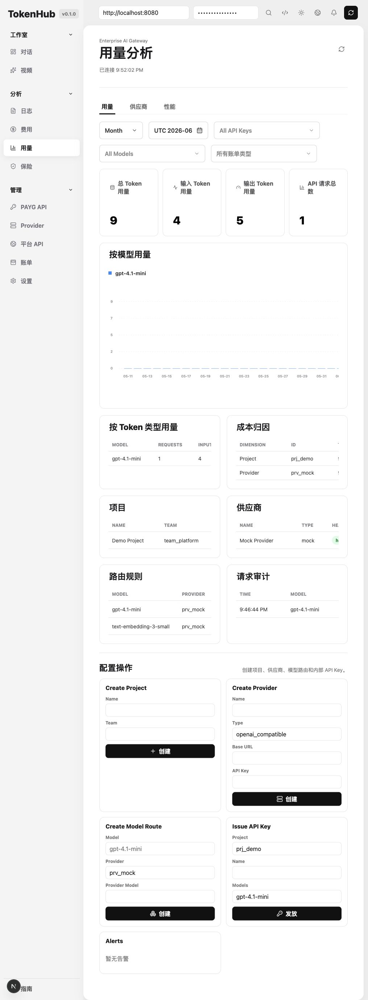

# 实现状态记录

本文件记录当前仓库中已经落地的功能、运行方式、验证结果和已知限制。

## 已实现范围

### Go 后端

目录：`backend/`

已实现：

- HTTP 服务入口：`cmd/tokenhub/main.go`
- 健康检查：`GET /healthz`
- OpenAI-Compatible Gateway：
  - `GET /v1/models`
  - `POST /v1/chat/completions`
  - `POST /v1/responses`
  - `POST /v1/embeddings`
- Gateway 能力：
  - Bearer API Key 鉴权
  - Project 绑定
  - 模型白名单
  - 请求额度
  - 并发限制
  - 多候选模型路由
  - Provider 路由命中审计
  - Provider 连接测试、标准模型映射和健康状态
  - 健康监控任务手动运行，可检测 Provider 和模型路由，回写最近状态并生成失败告警
  - 非流式 Provider 失败切换
  - 优先级 + 权重调度策略
  - 流式 SSE 响应
  - OpenAI 风格错误格式
  - Request ID
- Provider：
  - Mock Provider，可离线验证完整链路
  - OpenAI-Compatible Adapter
  - Azure OpenAI Adapter
  - Anthropic Adapter
  - Gemini Adapter
- 治理能力：
  - Token 估算
  - 成本估算
  - 用量记录
  - 请求日志
  - 额度告警事件
- Admin API：
  - 所有 `/api/admin/*` 需要 `Authorization: Bearer <admin-token>`
  - `GET /api/admin/overview`
  - `GET|POST /api/admin/projects`
  - `GET|POST /api/admin/projects/{id}/keys`
  - `GET|POST /api/admin/providers`
  - `GET|POST /api/admin/models`
  - `GET /api/admin/usage/summary`
  - `GET /api/admin/usage/breakdown`
  - `GET /api/admin/usage/timeseries`
  - `GET /api/admin/audit/requests`
  - `GET /api/admin/audit/requests/{request_id}`
  - `GET /api/admin/alerts`
  - `GET /api/admin/approvals`
  - `POST /api/admin/resources/monitors/{id}/run`
  - `POST /api/admin/projects/{id}/quota-increase`

### Next.js 前端

目录：`frontend/`

已实现：

- 管理后台首页和当前左侧菜单结构。
- 企业后台风格的浅色 UI。
- 登录页与管理员会话。
- 总览指标：请求量、Token、成本、错误数、Provider 数。
- 接口文档页和模型演练场。
- 用量柱状图：日粒度 Token 趋势。
- 项目空间，支持项目额度配置和额度提升申请。
- API Key 列表，支持发放、轮换、禁用和启用。
- 团队分组和用户管理，支持团队负责人、成员统计和用户导入入口。
- Provider 表。
- Provider 新增弹窗，支持服务商模板、Base URL、API Key、标准模型映射和连接测试。
- 模型目录和模型目录式路由策略视图。
- 健康监控表，支持默认监控任务、手动运行检测、查看最近状态/消息/延迟。
- 请求日志表和请求详情。
- 成本归因表：按项目、成员、模型、Provider 展示 Token 与成本。
- 告警规则、告警事件、通知渠道和通知记录。
- 成本中心、成本账单和导出报表页面。
- 审批记录页面，支持 Key 发放、额度提升和模型开通等治理审批。
- 安全策略、代理出口、数据备份、公告通知和系统设置页面。
- 创建项目表单。
- 发放 API Key 表单。
- 新 Key 明文一次性展示。

### 部署与配置

已实现：

- `.env.example`
- 后端 Dockerfile
- 前端 Dockerfile
- Docker Compose 骨架
- `.gitignore`
- README 本地运行说明

## Demo 数据

后端启动时会加载内存 Demo 数据：

- Project：`prj_demo`
- API Key：`thk_demo_local`
- Admin Token：`dev_admin_token`
- Provider：`Mock Provider`
- Chat 模型：`gpt-4.1-mini`
- Embedding 模型：`text-embedding-3-small`

## 验证命令

后端：

```bash
cd backend
go test ./...
```

前端：

```bash
cd frontend
npm run typecheck
npm run build
```

Smoke test：

```bash
curl http://localhost:8080/healthz

curl http://localhost:8080/v1/models \
  -H "Authorization: Bearer thk_demo_local"

curl http://localhost:8080/v1/chat/completions \
  -H "Authorization: Bearer thk_demo_local" \
  -H "Content-Type: application/json" \
  -d '{"model":"gpt-4.1-mini","messages":[{"role":"user","content":"smoke test"}]}'

curl http://localhost:8080/api/admin/overview \
  -H "Authorization: Bearer dev_admin_token"
```

## 本次验证结果

已通过：

- `go test ./...`
- `npm run typecheck`
- `npm run build`
- `curl /healthz`
- `curl /v1/models`
- `curl /v1/chat/completions`
- `curl /v1/chat/completions` stream 模式
- `curl /api/admin/usage/summary`
- `curl /api/admin/usage/timeseries`
- `curl /api/admin/export/requests`
- `curl /api/admin/resources/monitors/{id}/run`
- `curl /api/admin/projects/{id}/quota-increase`
- SQLite 手动备份、下载、确认式恢复和删除接口
- Admin API 无 Token 返回 `401 invalid_admin_token`
- 浏览器打开 `http://localhost:3000`
- 管理台成功连接 `http://localhost:8080`
- 管理台创建项目
- 管理台发放 API Key

浏览器验证截图：



## 已知限制

当前实现已经具备主要产品闭环，仍有一些生产化增强项：

- 默认使用 SQLite 持久化；已支持手动备份、下载、确认式恢复和删除，后续继续保持 SQLite-only，重点补齐定时备份、迁移和单机可靠性。
- 管理后台已接入本地管理员登录；RBAC、OIDC、LDAP 仍待生产化补齐。
- Provider 凭证暂未接入加密存储和 KMS。
- Token 统计是估算，真实 Provider 以响应 usage 为准。
- 流式上游 Provider 的 usage 可能无法从 SSE 中提取，当前会记录为 0 或估算值。
- 流式请求暂不做响应开始后的 Provider failover，避免污染 SSE 协议；后续可实现首字节前 failover。
- CORS 当前为开发友好配置，生产需要改为明确 Origin。
- 告警已落库，并支持 Webhook 通知渠道与投递记录。
- 健康监控已支持手动检测、状态回写和失败告警；定时巡检、监控历史和聚合报表仍待补齐。
- 成本中心、项目额度、审批记录、通知渠道、安全策略、公告和 CSV 导出已落库到 SQLite。
- Docker Compose 默认使用 SQLite volume 持久化；后续生产化继续围绕 SQLite 做数据卷、定时备份、恢复演练和归档。

## 下一步建议

1. 完善 SQLite 定时备份、迁移校验和数据归档。
2. 增加后端 RBAC 数据范围校验、OIDC、LDAP 与企业 SSO。
3. 完善 Provider 配置后台，包括凭证加密、健康检查、模型映射和模板同步。
4. 按需增加 Provider 内部资源池高级能力，用于同一服务商下多区域、多 Key、多本地集群的细粒度调度。
5. 增加 OpenAPI 文档和跨端类型生成。
6. 增加真实 Provider 的 contract tests。
7. 增加 Helm Chart 与生产配置模板。
